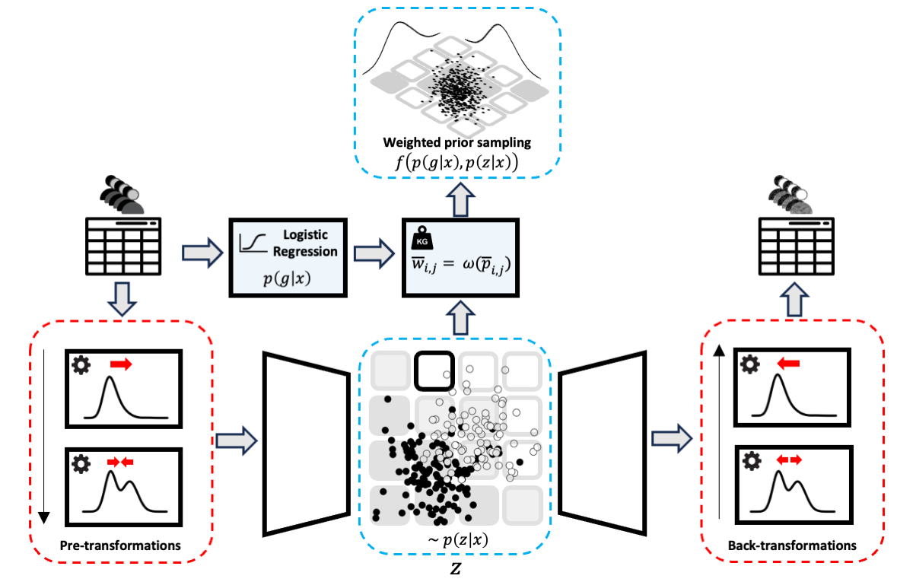

# LatentSubgroups



This is the implementation for **"Combining propensity score methods with variational autoencoders for generating synthetic data in presence of latent sub-groups"**.

## Abstract

In settings requiring synthetic data generation based on a clinical cohort, e.g., due to data protection requirements, heterogeneity across individuals might be a nuisance that we need to control or faithfully preserve. The sources of such heterogeneity might be known, e.g., as indicated by sub-groups labels, or might be unknown and thus reflected only in properties of distributions, such as bimodality or skewness. We investigate how such heterogeneity can be preserved and controlled when obtaining synthetic data from variational autoencoders (VAEs), i.e., a generative deep learning technique that utilizes a low-dimensional latent representation. To faithfully reproduce unknown heterogeneity reflected in marginal distributions, we propose to combine VAEs with pre-transformations. For dealing with known heterogeneity due to sub-groups, we complement VAEs with models for group membership, specifically from propensity score regression. The evaluation is performed with a realistic simulation design that features sub-groups and challenging marginal distributions. The proposed approach faithfully recovers the latter, compared to synthetic data approaches that focus purely on marginal distributions. Propensity scores add complementary information, e.g., when visualized in the latent space, and enable sampling of synthetic data with or without sub-group specific characteristics. We also illustrate the proposed approach with real data from an international stroke trial that exhibits considerable distribution differences between study sites, in addition to bimodality. These results indicate that describing heterogeneity by statistical approaches, such as propensity score regression, might be more generally useful for complementing generative deep learning for obtaining synthetic data that faithfully reflects structure from clinical cohorts.

## 🚀 Quick Start

### Prerequisites

- **Julia**: 1.6.7 or later
- **Git**: For cloning the repository

### Installation

1. **Clone the repository:**
   ```bash
   git clone https://github.com/your-username/LatentSubgroups.git
   cd LatentSubgroups
   ```

2. **Install Julia dependencies:**
   ```julia
   # Start Julia in the project directory
   julia --project=.
   
   # Install all dependencies
   using Pkg
   Pkg.instantiate()
   ```

3. **Run the main script:**
   ```julia
   # From Julia REPL in the project directory
   include("src/main.jl")
   ```

## 📁 Repository Structure

```
LatentSubgroups/
├── src/                          # Main source code
│   ├── main.jl                   # Main entry point
│   ├── VAE.jl                    # VAE implementation
│   ├── structs.jl                # Data structures and configuration
│   ├── load_data.jl              # Data loading utilities
│   ├── transformations.jl        # Pre-transformation methods
│   ├── GLM.jl                    # Propensity score methods
│   ├── classification.jl         # Classification utilities
│   ├── preprocess.jl             # Data preprocessing
│   ├── quantile_transformation.jl # Quantile transformation
│   ├── report.jl                 # Results reporting
│   └── evaluation/
│       └── evaluation.jl         # Model evaluation metrics
├── data/                         # Sample datasets
│   ├── simulation.csv            # Simulated data
│   ├── data_scenario1.csv        # Scenario 1 data
│   ├── data_scenario2.csv        # Scenario 2 data
│   └── ist_*.csv                 # IST stroke trial data
├── figures/                      # Generated figures and plots
├── AIQN/                         # Autoregressive Implicit Quantile Networks
├── GAN/                          # GAN implementation (alternative)
├── Norta-J/                      # NORTA method implementation
├── notebooks/                    # Jupyter notebooks for analysis
├── visualization/                # Visualization utilities
├── Project.toml                  # Julia project dependencies
├── Manifest.toml                 # Exact dependency versions
└── README.md                     # This file
```

## 🔧 Configuration

The main configuration is handled through the `Args` struct in `src/structs.jl`. Key parameters include:

### Dataset Selection
```julia
# Available datasets:
data_string = "sim"                    # Simulated data
data_string = "data_scenario1"         # Scenario 1
data_string = "data_scenario2"         # Scenario 2  
data_string = "ist_randomization_*"    # IST stroke trial variants
data_string = "toy"                    # Simple toy example
```

### Model Parameters
```julia
# VAE Architecture
latent_dim = 2                         # Latent space dimensions
hidden_dim = 9                         # Hidden layer size
multimodal_encoder = true              # Use separate encoders for different data types

# Training
epochs = 1000                          # Training epochs
batch_size = 128                       # Batch size
η = 1e-4                              # Learning rate
β = 0.5                               # KL divergence weight
```

### Pre-transformation Options
```julia
pre_transformation = true             # Enable PTVAE transformations
pre_transformation_type = "power"     # "power" or "quantile"
scaling = true                        # Enable data scaling
scaling_method = "standardization"    # "standardization" or "scaling"
```

### Propensity Score Sampling
```julia
IPW_sampling = true                   # Enable IPW sampling
subpopulation_mode = 2                # 0: class 0, 1: class 1, 2: both
grid_point_size = 0.2                # Grid resolution
δ = 0.1                              # Propensity score threshold
```

## 🎯 Usage Examples

### Basic VAE Training

```julia
using Pkg
Pkg.activate(".")

# Load the main modules
include("src/main.jl")

# The main script will:
# 1. Load the dataset specified in Args
# 2. Preprocess the data (transformations, scaling)
# 3. Train the VAE model
# 4. Generate synthetic data
# 5. Save results and visualizations
```

### Custom Dataset

To use your own dataset:

1. **Prepare your CSV file** with numerical data (binary variables as 0/1)
2. **Place it in the `data/` directory**
3. **Update the configuration:**

```julia
# Edit src/structs.jl, change the data_string:
data_string = "your_dataset_name"  # without .csv extension
```

### Training with Different Configurations

```julia
# Example: Train with quantile transformations instead of power transformations
args = Args(
    data_string = "sim",
    pre_transformation_type = "quantile",
    epochs = 500,
    latent_dim = 3
)

# Load and preprocess data
x, dataTypeArray, args = load_dataset()
preprocess_ps = preprocess_params(input_dim = args.input_dim)
preprocessed_data, preprocess_ps = preprocess!(args, preprocess_ps, x)

# Train model
model, training_data, loss_array = trainVAE!(preprocessed_data, x, dataTypeArray, preprocess_ps, args)
```

### Hyperparameter Optimization

```julia
# Enable hyperparameter search
args = Args(hyperopt_flag = true)

# This will search over combinations defined in Hyperparams struct
trainVAE_hyperparams_opt!(preprocessed_data, x, dataTypeArray, preprocess_ps, args)
```

## 📊 Outputs

The framework generates comprehensive outputs in the `runs/` directory:

### Generated Files
- **`synthetic_data_prior.csv`**: Synthetic data from prior sampling
- **`synthetic_data_posterior.csv`**: Synthetic data from posterior sampling
- **`vae.bson`**: Trained VAE model
- **Correlation plots**: Original vs synthetic data correlations
- **Marginal density plots**: Distribution comparisons
- **Latent space visualizations**: 2D latent representations

### Propensity Score Analysis (when `IPW_sampling = true`)
- **Propensity score distributions**
- **Weighted sampling visualizations**
- **Subgroup-specific synthetic data**

## 🔬 Key Features

### 1. **Pre-transformation VAE (PTVAE)**
- **Power transformations**: Handle bimodal/skewed distributions
- **Quantile transformations**: Normalize to standard distributions
- **Box-Cox transformations**: Stabilize variance

### 2. **Multimodal Architecture**
- **Separate encoders** for continuous and binary variables
- **Flexible fusion** strategies in latent space
- **Mixed data type support**

### 3. **Propensity Score Integration**
- **IPW sampling** for subgroup preservation
- **Latent space visualization** of propensity scores
- **Controlled synthetic data generation**

### 4. **Comprehensive Evaluation**
- **Utility metrics**: Propensity score-based evaluation
- **Distribution comparisons**: KS tests, correlation analysis
- **Visualization suite**: Extensive plotting capabilities

## 📈 Evaluation Metrics

The framework includes several evaluation methods:

```julia
# Utility measurement (propensity score-based)
pMSE, pMSE_ratio, Standardize_pMSE = utility(run_path)

# Feature selection evaluation  
selected_features, model = fit_logistic_regression_outcome_simulation(data)

# Classification accuracy
accuracy = predict_probability_outcome(model, data, data_string)
```

## 🛠️ Advanced Usage

### Custom Transformations

Add custom pre-transformations by modifying `src/transformations.jl`:

```julia
function custom_transform(x, params)
    # Your custom transformation
    return transformed_x
end
```

### Alternative Architectures

The repository also includes:
- **GAN implementation** (`GAN/`)
- **AIQN methods** (`AIQN/`)
- **NORTA baseline** (`Norta-J/`)

### Batch Processing

For multiple datasets or parameter sweeps:

```julia
datasets = ["sim", "data_scenario1", "data_scenario2"]
for dataset in datasets
    args = Args(data_string = dataset)
    # Run training pipeline
end
```

## 📋 Requirements

### Julia Packages
All dependencies are specified in `Project.toml`. Key packages include:

- **Flux.jl**: Deep learning framework
- **Distributions.jl**: Statistical distributions
- **CSV.jl, DataFrames.jl**: Data handling
- **Plots.jl**: Visualization
- **GLM.jl**: Generalized linear models
- **TensorBoardLogger.jl**: Experiment tracking

### System Requirements
- **RAM**: 8GB+ recommended for larger datasets
- **Storage**: 1GB+ for outputs and models
- **CPU**: Multi-core recommended for faster training

## 🐛 Troubleshooting

### Common Issues

1. **Package installation errors:**
   ```julia
   # Try updating the registry
   using Pkg
   Pkg.Registry.update()
   Pkg.resolve()
   ```

2. **Memory issues with large datasets:**
   - Reduce `batch_size` in configuration
   - Use smaller `epochs` for initial testing

3. **Convergence problems:**
   - Adjust learning rate `η`
   - Try different `β` values
   - Enable pre-transformations for skewed data

### Getting Help

- **Check the issues**: Look for similar problems in the repository issues
- **Julia documentation**: [https://docs.julialang.org/](https://docs.julialang.org/)
- **Flux.jl tutorials**: [https://fluxml.ai/Flux.jl/stable/](https://fluxml.ai/Flux.jl/stable/)

## 📚 Citation

If you use this code in your research, please cite:

```bibtex
@article{farhadyar_combining_2024,
	title = {Combining propensity score methods with variational autoencoders for generating synthetic data in presence of latent sub-groups},
	journal = {BMC Medical Research Methodology},
	author = {Farhadyar, Kiana and Bonofiglio, Federico and Hackenberg, Maren and Behrens, Max and Zöller, Daniela and Binder, Harald},
	year = {2024},
}
```

## 📄 License

This project is licensed under the MIT License - see the [LICENSE](LICENSE) file for details.

## 🤝 Contributing

1. Fork the repository
2. Create a feature branch (`git checkout -b feature/amazing-feature`)
3. Commit your changes (`git commit -m 'Add amazing feature'`)
4. Push to the branch (`git push origin feature/amazing-feature`)
5. Open a Pull Request

## 👥 Authors

- **[Author Name]** - *Initial work* - [GitHub Profile](https://github.com/username)

## 🙏 Acknowledgments

- International Stroke Trial (IST) data contributors
- Julia community for excellent ML ecosystem
- Reviewers and collaborators